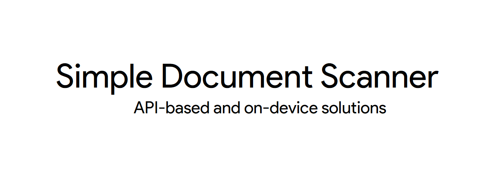
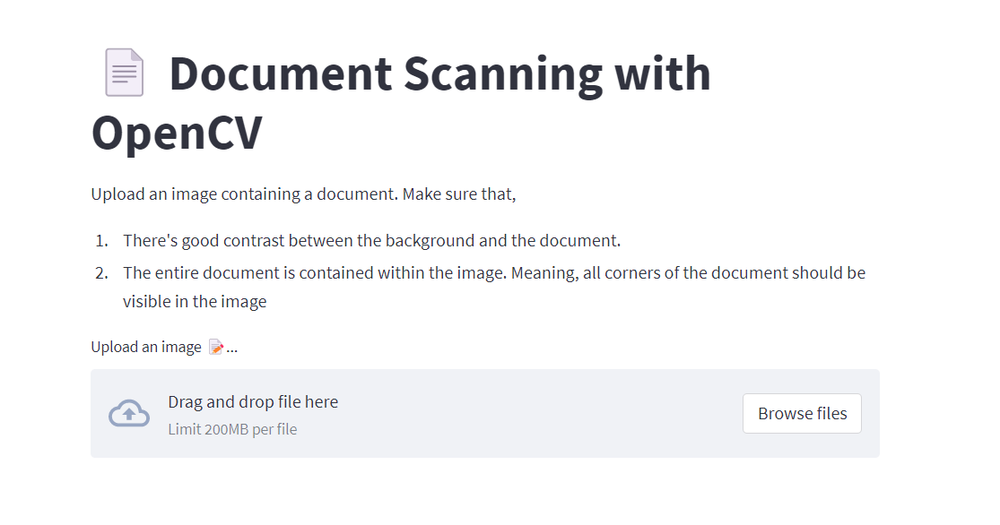

# 📄 Simple Document Scanner in Android




## Document Scanning App

The simplest document scanning app. It only contains the code necessary to provide the basic functionality of a document scanning app, and hence can be extended to meet your requirements.

The app can either use an API to crop documents or built-in OpenCV package for on-device document scanning.


### Using the API-based app 
> See [`main`](https://github.com/shubham0204/Simple_Document_Scanner_Android/tree/main) branch

This app calls an API to get the coordinates of the corners of the document and also to binarize it. The image processing algorithm remains the same in both the options.

The API is developed with [FastAPI](https://fastapi.tiangolo.com/) in Python and uses [OkHttp](https://square.github.io/okhttp/) as a client to make requests. For more details on how to run the API server, see [Document Scanning API](#document-scanning-api).

There's no additional setup required to setup the Android project for this app. Clone the `main` branch and open the resulting directory in Android Studio.


### Using the on-device document scanning app 
> See [`on_device_scanning_app`](https://github.com/shubham0204/Simple_Document_Scanner_Android/tree/on_device_scanning_app) branch

This app uses [OpenCV 4.5.5 Android SDK](https://sourceforge.net/projects/opencvlibrary/files/4.5.5/opencv-4.5.5-android-sdk.zip/download) to uses the same image processing algorithm as that in API-based app.


### Motivation

There are a lot of document scanner apps for Android, some of which are open-source and provide better accuracy. The perks of using and extending this project are,

* The core idea behind this project was **simplicity**. The source code is easy to understand even for beginners in Android and they can easily familiarize themselves with it.
* The project utilizes the **latest Android libraries for Kotlin** like Coroutines, Room, Scoped Storage
* It provides **two options to deploy the document scanning service**. The Android app on the `main` branch uses an API to crop the documents whereas the Android app on the `on_device_scanning_app` performs detection on-device and works without any networking.
* You can learn how to use **OpenCV in Kotlin and its setup** by viewing the `on_device_scanning_app` branch.


### Android/Kotlin libraries used in this project

* [OpenCV Android](https://opencv.org/android/) ( Needs Android NDK )
* [Kotlin Coil](https://github.com/coil-kt/coil)
* [Material Dialogs](https://github.com/afollestad/material-dialogs)
* [AndroidX Room](https://developer.android.com/training/data-storage/room)
* [Kotlin Coroutines](https://developer.android.com/kotlin/coroutines)


## Document Scanning API

> 👉 *[Go to the `api` branch](https://github.com/shubham0204/Simple_Document_Scanner_Android/tree/api)*


The `api` branch contains the code for the API built using [FastAPI](https://fastapi.tiangolo.com/) in Python. First, install the required packages from `requirements.txt` in a Python virtual environment,

```
> python venv doc_scanning_env
> source doc_scanning_env/bin/activate
> ( doc_scanning_env ) pip install -r requirements.txt
```

### Using the API locally

To run the FastAPI server locally, use

```
> uvicorn main:app 
```
in the source code directory where `main.py` is located. Make sure that,

* **The mobile device on which the app is running and the computer on which the server runs, are connected to the same network.**
* **On Windows, make sure you turn-off the Firewall while testing the app.**

### Using the Streamlit app



You can also perform document scanning with the Streamlit app, that let's you upload your image and outputs the boundaries of the document. To run the Streamlit app locally, use,

```
> streamlit run app.py
```


### Building and running the Docker image

You can bundle the code in a Docker image and build it,

```
# Make sure you're in the source directory
> docker build --tag document_scanning_api .
```